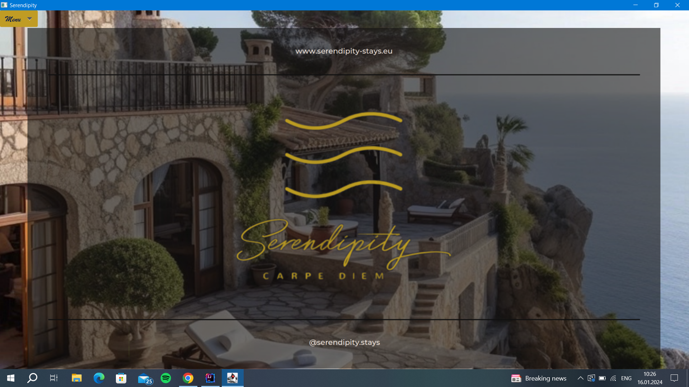
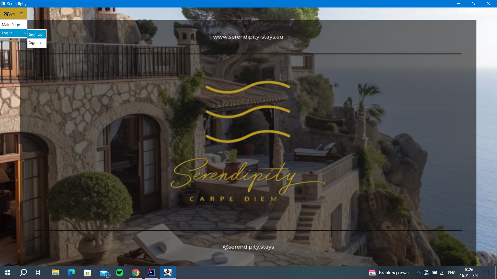

# Apartment booking app

The main goal of this project is to familiarize with SQL, Java and IDEs that are used for this(in my case Intellij and DBeaver), along with the integration of a database with JDBC.  

## Table of Contents

- [Description](#Description)
  - [Preliminaries](#Preliminaries) 
  - [Screens](#Screens)
  - [Java Class Diagram](#Java)
  - [Database](#Database)
- [Installation](#installation)
- [Usage](#usage)
- [Further developments](#Further-developments)
- [License](#license)

## Description

### Preliminaries

The project has two big parts: 
- the GUI written in Java and JavaFX 
- the database based on postgres servers

For the connectivity between the two, JDBC was used. All the methods that were used for the connection with the database(taking information from it or updating it) are stored in a utility class called DBeaver.

### Screens

The GUI has 7 screens:
- Home Screen

  
    The launching screen. This one includes the logo of the app, some contact information and a menu button. From there one can choose to go to one of the next screens, the sign in or the sign up.
      

- Sign In and Sign Up Screens:
 
	 This screens are used for the login part. If you want to create an account, you go to the Sign Up screen and fill in the required information then press the button to create an account. If you already have an account you go to the Sign In screen where you fill in your username and password in order to enter your account.
	 
- Logged In Screen
	
	This screen pops up after you successfully created an account or after you entered your account. On this screen one can see his profile photo along with the users name in the top right corner and a big list in the center of the screen. This list has all the apartments displayed along with one photo and some information for each. Above the list there is a search bar and some filter by and sort by buttons. The search bar can search in the name, location or the tags of the apartment.
	
- Apartment Screen

	If you press on a photo of an apartment the next screen that will appear will be the apartment screen. On this one you will be able to see all the information available on that specific apartment, you can see multiple photos if the apartment has more, you can see previous reviews, and of course you can make a reservation. It is obvious that you cannot book an already booked date or you cannot book in the past and of course you cannot select the check out date to be earlier than the check in.
	
- User Screen

When in the Logged In Screen if you press on the profile picture of the user you will be sent to the user's screen. Here you can see all the information available on the user: profile picture, first name, last name, username and all the bookings made(password is not displayed due to security reasons). After the check out date of a booking has passed(supposedly the user visited the apartment) a review field will appear for that certain reservation. The user can give a rating and a short comment. After sending it, it will be displayed on the review list of that apartment and in the user's account below the reservation that he reviewed. 
  
 - Admin Screen

 Only the admin accounts have the rights to see this screen. On this screen is displayed a list with all the users with their information(including password). Each item of the list has a delete button and the admin can remove the account of any user, including all the reservations and reviews made by them.

### Java

The frontend of the project is made using JavaFX. All the screens are made using Grid Panes so they resize automatically. For the styling of the components(lists, buttons, fields, datepicker, etc.) I used some css files(a few are from an imported library). For the lists that I used, I used custom cells in order to be able do display everything I want in each cell.
The backend consists mainly of my sql utility class. In this classed I wrote some methods for each functionality that I needed(add user, verify user, get all apartments, make booking, make review, etc.) Each method establishes a connection to the database and sends a specific query in order to help with solving the problem. For example to get all the apartments, after sending the query to the database I used the result set in order to fetch the data and add it into a java list, so that it could be displayed later.
### Database

  
## Installation

Retrieve the project files along with the necessary dependencies, set up the database, restore data, and initiate the application within an Integrated Development Environment (IDE) like IntelliJ.

## Usage

This is the Sign Up screen:

After creating an account you can see all the apartments and choose one that you like:

After choosing one you can make a reservation for that:

After making the reservation you can see it in your account:

## Further developments

The next step would be to implement a card payment as for now you can only book the apartments and pay later in person at the property.
Another important future step could be to implement a different type of accounts: hosts. They should be able to add apartments and see all the details on their apartments.
Some other developments for the future could be a message option so the users could talk to the hosts.

## License
